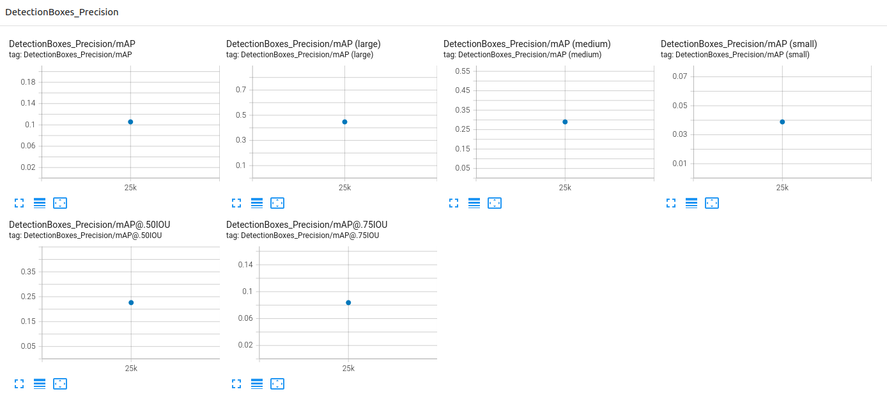
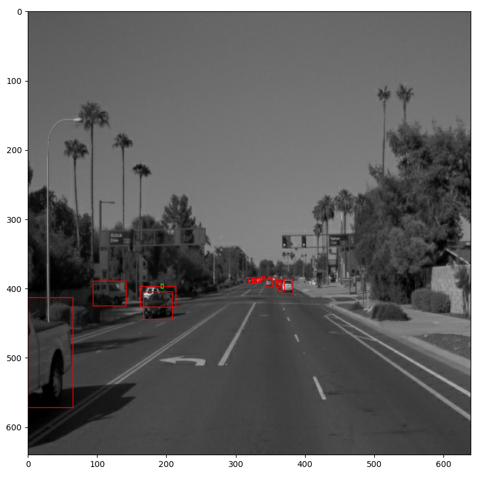
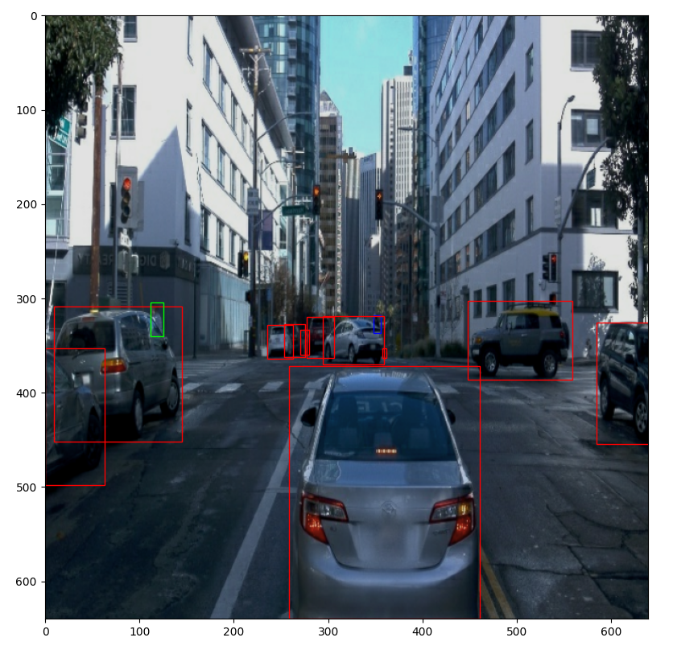

# Object Detection in an Urban Environment

## Project overview

Object detection techniques are indispensable parts for autonomous driving. Accurately detecting the surrounding objects can help autonomous vehicles react and prevent potential collisions. In this project, we use deep learning approaches to detect objects in urban environments. The [Waymo Open dataset](https://waymo.com/open/), which provides rich and yet various driving scenes, is used to train our neural network models. We first analyze the data in Waymo Open dataset and split the data into training, validation and test sets based on the cross-validation method. And we perform the training and further improve the model with different strategies. 

| | |
|:---------------:|:---------------:|
| |  |

## Dataset

### Dataset analysis

The first step is to [download and process the dataset](README.md#download-and-process-the-data) to get necessary information for object detections in camera images. The new tfrecord format contains the image being resized to 640x640 and the bounding box information. The function of randomly displaying 10 images, as shown below, is implemented to check whether the image associated its corresponding bounding boxes and class labels are presented correctly.

Next, we take 18000 images from dataset for analyzing the the number of objects for each class, the number of bounding boxes, etc.  
In the image shown below, we can see the number of `car` are much more than `pedestrian` and `cyclist`. The main reason might be the fact that ega-car does not always drive in downtown, so not many people actually appear in the scene. The number of `pedestrian` and `cyclist` for training a model may not be sufficient.

Now we look at the statistics of driving scenes for daytime/night. Each image is converted to gray-scale image and the pixels' average value is calculated. If the average value is less than 50, we identify the image is taken at night. The results showed that the number of images taken in daytime is dominant, which make it more challenging for recognizing objects in the darker scenes.

Next, we analyze the bounding box's total count and the distribution of the bounding box sizes in images. As shown below, there are fair amount of images containing over 30 bounding boxes. It may imply that some of the objects are overlapped, which means only partial information is captured by the camera. The area of bounding box varies from less than 10 by 10 pixels (small area) to over 100 by 100 pixels (large area).

| | |
|:---------------:|:---------------:|
| |  |

### Cross validation

Since the images in the same Trip IDs in Waymo open dataset have similar characteristics (number of object for each class, images taken in the daytime/at night and so on), we split those images in the same group. Here split the data into training, validation and test sets. More specifically, 75% for training, 15% for validation and 10% for test. Each set has its own folder containing its corresponding images split from the processed Waymo open data. 

## Training

### Reference experiment (Experiment 0)

We perform the transfer learning using [SSD_ResNet50 model](http://download.tensorflow.org/models/object_detection/tf2/20200711/ssd_resnet50_v1_fpn_640x640_coco17_tpu-8.tar.gz) with the [default pipeline configuration](https://github.com/PoChang007/Object_Detection_in_Urban_Env/tree/main/experiments/experiment_0). The results of Loss and Detection Box Recall/Precision will be served as baselines. The curve in orange is Loss in training steps and blue dot is Loss in evaluation. The classification loss between training (0.1482) and evaluation (0.3724) is around 0.2242. To improve the initial results, we can add more variabilities in our data to simulate different environments during training. Hence, we will add more options of data augmentation in the pipeline configuration. 

### Improve on the reference

#### Data Augmentation

Here we try several options of data augmentation such as gray-scale image conversion, random pixel value scale, hue, saturation, brightness adjustments based on [`preprocessor.proto`](https://github.com/tensorflow/models/blob/master/research/object_detection/protos/preprocessor.proto). The experiments with strategies of augmenting data are described in the [next section](#experiment-1).

| | |
|:---------------:|:---------------:|
| |  |
| |  |

#### Experiment 1

The processing operations on images are added in data augmentation part in [pipeline_config](https://github.com/PoChang007/Object_Detection_in_Urban_Env/tree/main/experiments/experiment_1):

* Randomly convert the rgb image to the gray image
* Randomly scale the value of all pixels between the defined range
* Randomly distort RGB value
* Randomly decide jpeg quality between the defined range

Since the baseline config already has randomly horizontal flipping and randomly image cropping, manipulating pixel values may have better chances to improve the model. The following figures showed the difference (0.1341) of Classification Loss between training (0.1697) and evaluation (0.3038) getting closer, and the DetectionBoxes_Precision as well as Recall have improvements comparing to the baseline results.

#### Experiment 2

The processing operations on images are added in data augmentation part in [pipeline_config](https://github.com/PoChang007/Object_Detection_in_Urban_Env/tree/main/experiments/experiment_2):

* Randomly convert the rgb image to the gray image
* Randomly adjust image brightness
* Randomly changes hue value
* Randomly changes saturation with the defined range

As shown in the figures below, the difference (0.1242) of Classification Loss between training (0.1366) and evaluation (0.2608) is also better than the baseline. The evaluation metrics, Precision and Recall, also got improved.

### Discussion

There are some other options in pipeline_config that may potentially improve the model. However, the class labels (hardly see any cyclist) and images taken in different conditions (rain, fog, night time) are not balanced. It will be nice to have more diverse sets of data for training. Moreover, some of the ground truth bounding boxes in Waymo Data are super small, which nearly cannot be perceived by human eye for data confirmation.

## Results

After the improved model is exported, we perform object detection on driving scenes stored in test set.  
The following video demonstrates the results of object detection based on the exported model.

